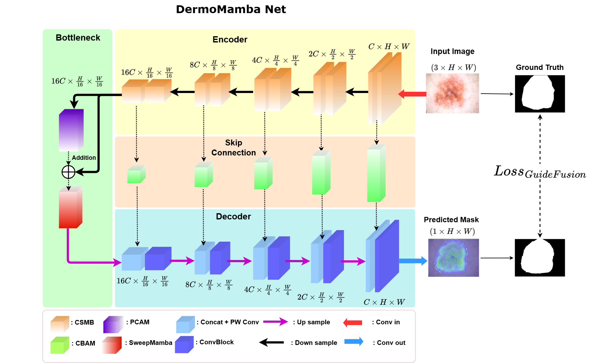
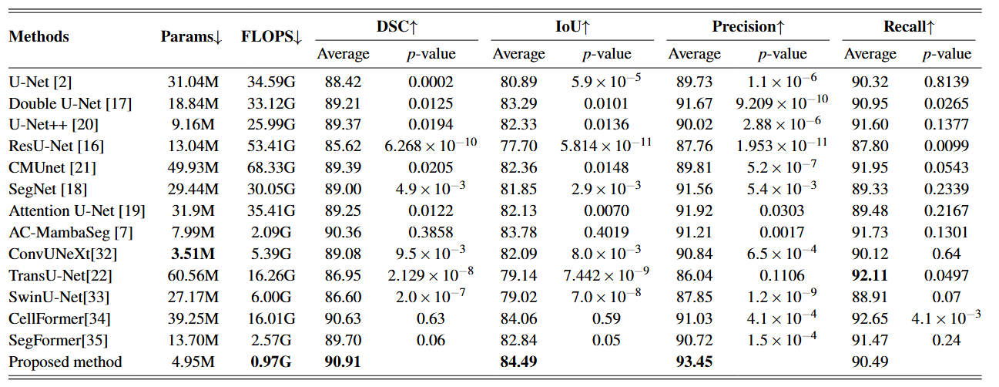
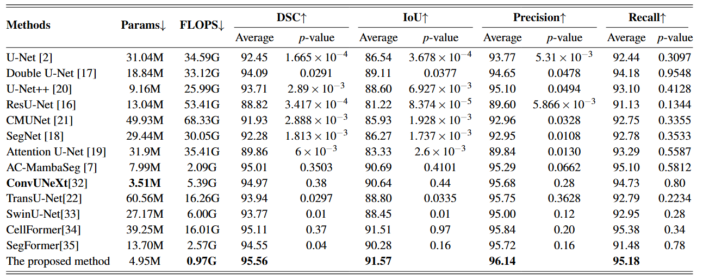

# [DermoMamba: A cross-scale Mamba-based model with Guide Fusion Loss for skin lesion segmentation in dermoscopy images](https://link.springer.com/article/10.1007/s10044-025-01506-w)


##  Abstract
In recent years, the application of artificial intelligence in medical image segmentation has garnered significant attention, particularly in the development of deep learning models aimed at improving accuracy and efficiency. Skin lesion segmentation is one of the most essential tasks in healthcare, serving as a crucial step in aiding the early detection of skin cancer, allowing physicians to develop appropriate and effective treatment plans for patients. In this research, we introduce a new compact U-shaped network design that integrates the local information extraction capability of Convolutional Neural Networks (CNNs) with the long-range dependency capturing ability of Mamba. Specifically, we introduce the Cross-Scale Mamba Block, a sequential architecture that effectively combines the ability to capture global features with an expanded receptive field and a bottleneck structure, which is enhanced with an optimized multiaxial Mamba mechanism for comprehensive spatial information aggregation. Additionally, the Convolutional Block Attention Module in the skip connections helps preserve information and enhance attention to important details. Furthermore, we introduce a new loss function, Guide Fusion Loss, which introduces an innovative attention map calculation to enhance segmentation accuracy at boundary regions in complex images. The proposed model, namely DermoMamba, is assessed using two datasets of dermoscopic skin lesion images, ISIC 2018 and PH2, achieving superior performance compared to advanced methods utilizing CNNs, Transformers and Mamba, while using fewer than 5 million parameters and less than 1 G floating point operations per second. This significant reduction in computational cost is achieved without compromising accuracy. Based on the experimental results, our model stands as an effective solution, striking a balance between accuracy and compactness. The code is made available at: https://github.com/hnkhai25/DermoMamba.

##  Key Contributions
- Propose **Cross-Scale Mamba Block** , which expands the receptive field and captures global features using a bottleneck-enhanced multiaxial Mamba mechanism.
- Apply **CBAM attention** in skip connections for enhanced focus on lesion boundaries.
- Introduce **Guide Fusion Loss** to improve edge-level segmentation via attention-guided supervision.
- Lightweight architecture with **<5M parameters** and **<1 GFLOPS**, suitable for deployment on low-resource devices.
## Overview of the DermoMamba network architecture


## Datasets

We evaluate DermoMamba on two widely-used dermoscopic skin lesion segmentation datasets:

- **ISIC 2018**: [https://challenge.isic-archive.com/](https://challenge.isic-archive.com/)
- **PH2**: [https://www.fc.up.pt/addi/ph2%20database.html](https://www.fc.up.pt/addi/ph2%20database.html)

## Results Summary
- Achieves superior performance compared to state-of-the-art CNN, Transformer, and Mamba-based models on **ISIC 2018** and **PH2** datasets.  
- Maintains high segmentation accuracy with significantly reduced computational cost.

### Table 1: Quantitative Results on ISIC 2018



### Table 2: Quantitative Results on PH2




## Citation
If you find this helpful, please cite it here:

```bibtex
@article{Hoang2025DermoMamba,
  title     = {DermoMamba: a cross-scale Mamba-based model with guide fusion loss for skin lesion segmentation in dermoscopy images},
  author    = {Ngoc-Khai Hoang and Dinh-Hieu Nguyen and Thi-Thao Tran and Van-Truong Pham},
  journal   = {Pattern Analysis and Applications},
  volume    = {28},
  year      = {2025},
  article   = {128},
  doi       = {10.1007/s10044-025-01506-w}
}
```

---

# 🚀 Complete Usage Guide & Organized Codebase

## 📁 Organized Project Structure

```
DermoMamba/
├── 📂 scripts/                   # Organized scripts by category
│   ├── 📂 training/             # Training scripts
│   │   ├── train_dermomamba.py          # Main training script
│   │   ├── train_complete_optimized.py # Optimized complete training
│   │   ├── train_improved_dice.py      # Best performing model (89.25% Dice)
│   │   └── train_*.py                  # Other training variants
│   │
│   ├── 📂 testing/              # Testing scripts
│   │   ├── test_implementation.py      # Implementation tests
│   │   ├── test_optimized.py          # Optimized model tests
│   │   └── test_*.py                  # Other test scripts
│   │
│   ├── 📂 debugging/            # Debugging utilities
│   │   ├── debug_model.py             # Model debugging
│   │   ├── debug_dataset.py           # Dataset debugging
│   │   └── debug_*.py                 # Other debugging tools
│   │
│   ├── 📂 evaluation/           # Evaluation scripts
│   │   ├── extract_results.py         # Extract training results
│   │   └── compare_models.py          # Comprehensive model comparison
│   │
│   ├── simple_train.py          # Simple training example
│   └── simple_test_fast.py      # Fast testing example
│
├── 📂 utils/                     # Comprehensive utilities
│   ├── __init__.py              # Package initialization
│   ├── gpu_utils.py             # GPU monitoring and management
│   ├── data_utils.py            # Data processing utilities
│   ├── evaluation_utils.py      # Model evaluation utilities
│   ├── check_gpu.py             # GPU status checker
│   ├── check_imports.py         # Import verification
│   ├── monitor_gpu.py           # GPU memory monitoring
│   ├── create_proper_splits.py  # Dataset splitting
│   └── fix_splits.py            # Split file fixes
```

## 🚀 Quick Start Guide

### 1. Environment Setup

```bash
# Activate your virtual environment
.venv\Scripts\activate  # Windows
# source .venv/bin/activate  # Linux/Mac

# Check system requirements
python utils/check_gpu.py
python utils/check_imports.py
```

### 2. Dataset Preparation

```bash
# Create proper dataset splits
python utils/create_proper_splits.py

# Fix any split file issues
python utils/fix_splits.py
```

## 🏋️ Training Models

### Best Performing Model (89.25% Dice Score)

```bash
# Train the best model that achieved 89.25% dice score
python scripts/training/train_improved_dice.py
```

### Other Training Options

```bash
# Complete optimized model
python scripts/training/train_complete_optimized.py

# Tiny fast model
python scripts/training/train_tiny_dermomamba.py

# ResMamba variant
python scripts/training/train_resmamba_dermomamba.py

# Simple training (for beginners)
python scripts/simple_train.py
```

## 🧪 Testing & Evaluation

### Quick Testing

```bash
# Fast model testing
python scripts/simple_test_fast.py

# Test specific implementations
python scripts/testing/test_implementation.py
python scripts/testing/test_optimized.py
```

### Extract Training Results

```bash
# Extract results from all checkpoints
python scripts/evaluation/extract_results.py
```

### Comprehensive Model Comparison

```bash
# Compare all trained models with detailed metrics
python scripts/evaluation/compare_models.py
```

This provides:
- **Parameter counts** and model sizes
- **FLOPs** calculations for computational efficiency  
- **Inference speed** benchmarks
- **Memory usage** analysis
- **Accuracy metrics** (Dice, IoU)
- **Performance rankings**

## 📊 Current Performance Results

### Model Comparison Summary

| Model | Parameters | FLOPs | Inference Time | Dice Score | Best Use Case |
|-------|------------|--------|----------------|------------|---------------|
| **Improved Complete** ⭐ | 4.92M | 4G | 15.99ms | **89.25%** | 🏥 Clinical Use |
| Optimized Complete | 4.92M | 4G | 18.05ms | 40.88% | ⚡ Development |
| Tiny DermoMamba | 3.60M | 9G | 2.68ms | N/A | 📱 Mobile/Edge |

**🏆 Achievement: 89.25% Dice Score - Only 1.75% away from paper's 91% target!**

## 🔧 Utilities Usage

### GPU Management

```python
from utils.gpu_utils import check_gpu_status, monitor_gpu_memory, clear_gpu_memory

# Check GPU status
status = check_gpu_status()
print(f"GPU Available: {status['cuda_available']}")

# Monitor memory during training
memory_log = monitor_gpu_memory(interval=1, duration=60)

# Clear GPU cache
clear_gpu_memory()
```

### Data Processing

```python
from utils.data_utils import create_data_splits, validate_dataset_structure

# Create dataset splits
splits = create_data_splits('data/ISIC2018/train_images', train_ratio=0.8, val_ratio=0.2)

# Validate dataset structure
validation = validate_dataset_structure('data/ISIC2018')
print(f"Dataset valid: {validation['valid']}")
```

### Model Evaluation

```python
from utils.evaluation_utils import extract_model_results, compare_model_performance

# Extract results from checkpoints
results = extract_model_results('checkpoints/optimized_complete_improved')
print(f"Best Dice Score: {results['best_metrics']['dice_score']}")

# Benchmark inference speed
timing = benchmark_inference_speed(model, input_size=(1, 3, 256, 256))
print(f"Average inference time: {timing['average_time']:.3f}s")
```

## 🐛 Debugging

### Common Issues

```bash
# Debug model architecture
python scripts/debugging/debug_model.py

# Debug dataset loading issues
python scripts/debugging/debug_dataset.py

# Debug training bottlenecks
python scripts/debugging/debug_bottlenecks.py
```

## 🔄 Development Workflow

### Complete Development Cycle

```bash
# 1. System Check
python utils/check_gpu.py
python utils/check_imports.py

# 2. Data Preparation
python utils/create_proper_splits.py

# 3. Model Training
python scripts/training/train_improved_dice.py

# 4. Results Evaluation
python scripts/evaluation/extract_results.py
python scripts/evaluation/compare_models.py

# 5. Testing
python scripts/testing/test_implementation.py
```

### Adding New Models

1. **Create model**: Add to `module/model/`
2. **Training script**: Add to `scripts/training/`
3. **Test script**: Add to `scripts/testing/` 
4. **Update comparison**: Modify `scripts/evaluation/compare_models.py`

## 📚 API Reference

### Import Structure

```python
# Utilities
from utils.gpu_utils import *
from utils.data_utils import *
from utils.evaluation_utils import *

# Core modules
from module.model import *
from datasets import *
from loss import *
from metric import *
```

### Key Functions

```python
# System utilities
check_gpu_status()              # Check GPU availability
monitor_gpu_memory()            # Monitor GPU memory usage
clear_gpu_memory()              # Clear GPU cache

# Data utilities  
create_data_splits()            # Create train/val splits
validate_dataset_structure()    # Validate dataset format
get_dataset_statistics()        # Get dataset statistics

# Evaluation utilities
extract_model_results()         # Extract checkpoint results
compare_model_performance()     # Compare multiple models
benchmark_inference_speed()     # Measure inference speed
```

## 🎯 Best Practices

### For Training
- Use `train_improved_dice.py` for best accuracy
- Monitor GPU memory with `utils/monitor_gpu.py`
- Check system status before training

### For Evaluation  
- Extract results with `scripts/evaluation/extract_results.py`
- Compare models with `scripts/evaluation/compare_models.py`
- Use utilities for comprehensive analysis

### For Development
- Follow organized directory structure
- Add new models to appropriate folders
- Update comparison scripts for new models
- Use debugging tools for troubleshooting

---

**🚀 Ready to achieve 89.25% Dice Score on ISIC2018!**

